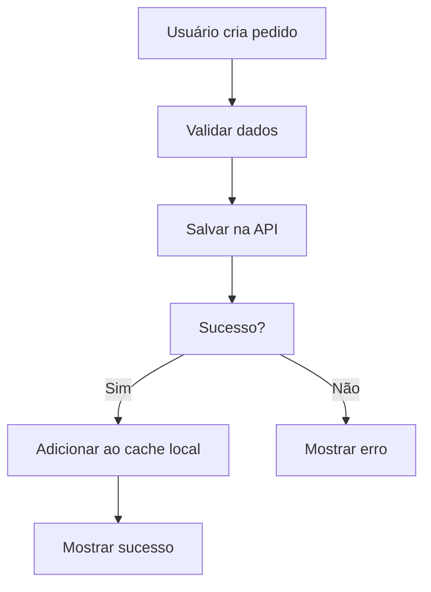
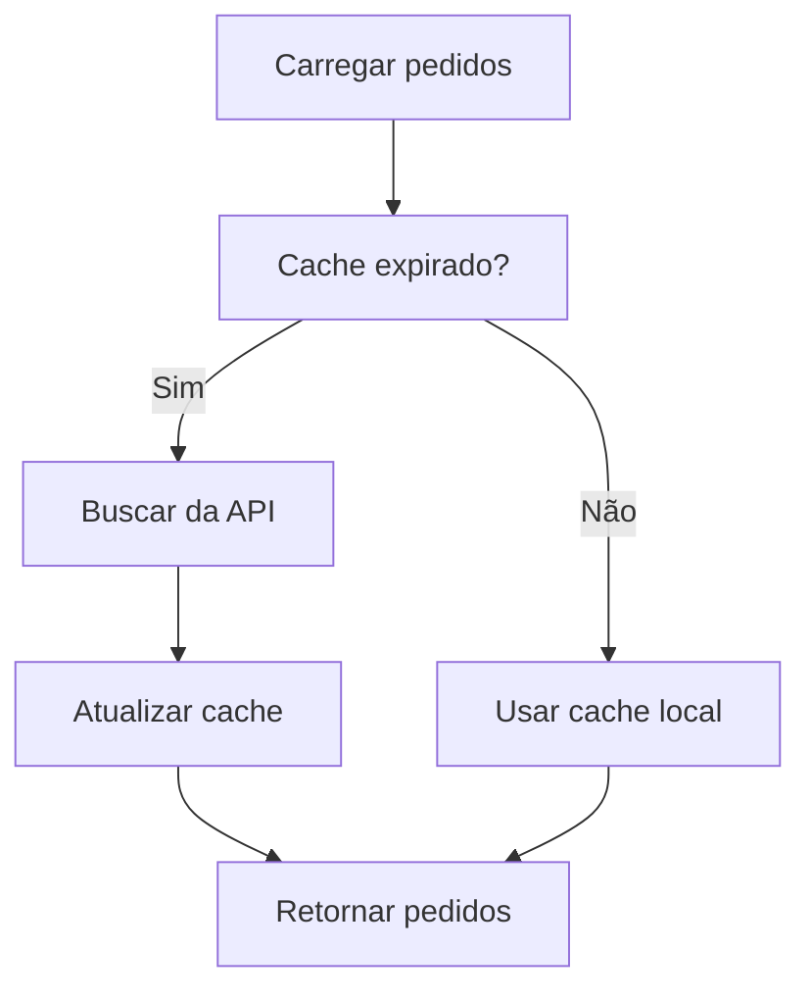
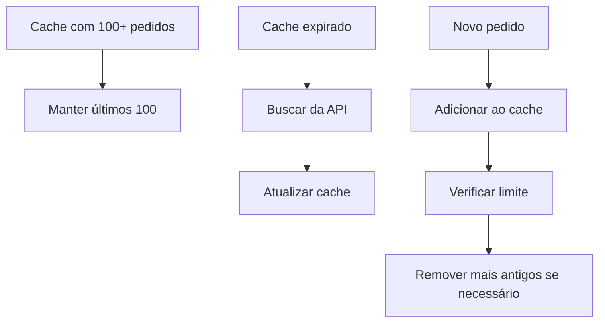

# Sistema de Cache Inteligente para Pedidos

## 📋 **Visão Geral**

O sistema implementa um cache inteligente que:
- **Salva apenas na API** (não mais no localStorage como backup)
- **Mantém cache local** dos últimos 100 pedidos para economizar requisições
- **Sincronização automática** com expiração de 5 minutos
- **Fallback gracioso** em caso de erro na API

## 🔧 **Funcionalidades**

### **1. Salvamento Exclusivo na API**
- ✅ Todos os pedidos são salvos **apenas na API**
- ✅ Não há mais salvamento duplo (API + localStorage)
- ✅ Erro na API = falha total (não salva localmente)

### **2. Sistema de Cache Inteligente**
- ✅ **Limite de 100 pedidos** em cache local
- ✅ **Expiração de 5 minutos** - após isso, busca da API
- ✅ **Cache automático** - mantém os últimos pedidos carregados
- ✅ **Sincronização manual** via botão na interface

### **3. Economia de Requisições**
- ✅ **Primeira carga**: Busca da API e armazena em cache
- ✅ **Próximas cargas**: Usa cache se não expirou
- ✅ **Atualizações**: Sincroniza apenas quando necessário
- ✅ **Cache inteligente**: Remove pedidos antigos automaticamente

## 📁 **Arquivos Modificados**

### **`src/utils/pedidosCache.js`** (NOVO)
```javascript
// Sistema de cache inteligente
class PedidosCache {
  // Carrega pedidos do cache ou da API
  async getPedidos(forceRefresh = false)
  
  // Força sincronização com a API
  async forceSync()
  
  // Adiciona pedido ao cache
  addPedido(pedido)
  
  // Atualiza pedido no cache
  updatePedido(pedidoId, updates)
  
  // Remove pedido do cache
  removePedido(pedidoId)
  
  // Obtém estatísticas do cache
  getCacheStats()
}
```

### **`src/components/CreateOrder.jsx`**
```javascript
// ANTES: Salvava na API + localStorage
// DEPOIS: Salva apenas na API + adiciona ao cache

// Salvar apenas na API
const response = await createPedido(apiPedido);

// Adicionar ao cache local
pedidosCache.addPedido(pedidoCompleto);
```

### **`src/pages/PageHome.jsx`**
```javascript
// ANTES: Carregava da API ou localStorage
// DEPOIS: Usa sistema de cache inteligente

// Usar sistema de cache inteligente
const pedidosCache = await pedidosCache.getPedidos();
```

## 🚀 **Como Funciona**

### **Fluxo de Salvamento:**


### **Fluxo de Carregamento:**


### **Sistema de Cache:**


## 📊 **Estatísticas do Cache**

O sistema fornece estatísticas em tempo real:
- **Pedidos em cache**: Quantos pedidos estão no cache local
- **Total de pedidos**: Quantos pedidos existem na API
- **Última sincronização**: Quando foi a última atualização
- **Cache expirado**: Se o cache precisa ser atualizado
- **Status de carregamento**: Se está sincronizando

## 🎯 **Benefícios**

### **1. Performance**
- ✅ **Carregamento mais rápido** - usa cache local
- ✅ **Menos requisições** - evita chamadas desnecessárias
- ✅ **Experiência fluida** - dados sempre disponíveis

### **2. Economia de Recursos**
- ✅ **Reduz carga na API** - menos requisições
- ✅ **Economiza bandwidth** - dados já em cache
- ✅ **Melhora responsividade** - resposta instantânea

### **3. Confiabilidade**
- ✅ **Fallback inteligente** - usa cache em caso de erro
- ✅ **Sincronização automática** - mantém dados atualizados
- ✅ **Recuperação automática** - tenta novamente em caso de erro

## 🔄 **Sincronização Manual**

### **Botão de Sincronização:**
- **Localização**: Na página inicial, ao lado dos outros botões
- **Funcionalidade**: Força sincronização com a API
- **Indicador**: Mostra spinner durante sincronização
- **Tooltip**: Exibe estatísticas do cache

### **Quando Sincronizar:**
- ✅ **Dados desatualizados** - cache expirado
- ✅ **Problemas de conectividade** - após reconexão
- ✅ **Atualizações importantes** - antes de operações críticas

## ⚙️ **Configurações**

### **Limites do Cache:**
```javascript
const CACHE_LIMIT = 100;        // Máximo de pedidos em cache
const CACHE_EXPIRY = 5 * 60 * 1000; // 5 minutos de expiração
```

### **Chaves do localStorage:**
```javascript
const CACHE_KEY = 'pedidos_cache'; // Chave para armazenar cache
```

## 🐛 **Tratamento de Erros**

### **Erro na API:**
- ✅ **Log do erro** - registra detalhes do problema
- ✅ **Cache existente** - usa dados em cache se disponível
- ✅ **Feedback ao usuário** - mostra mensagem de erro

### **Cache corrompido:**
- ✅ **Recuperação automática** - recria cache se necessário
- ✅ **Fallback para API** - busca dados diretamente
- ✅ **Log de problemas** - registra incidentes

## 📈 **Monitoramento**

### **Logs Automáticos:**
- ✅ **Carregamento de pedidos** - fonte (cache/API)
- ✅ **Sincronização** - sucesso/falha
- ✅ **Operações de cache** - adição/atualização/remoção
- ✅ **Estatísticas** - performance e uso

### **Métricas Disponíveis:**
- **Pedidos em cache** vs **Total na API**
- **Tempo de sincronização**
- **Taxa de sucesso** das requisições
- **Uso de cache** vs **Chamadas à API**

## 🎊 **Resultado Final**

O sistema agora:
1. **Salva apenas na API** - dados centralizados
2. **Usa cache inteligente** - performance otimizada
3. **Economiza requisições** - reduz carga no servidor
4. **Mantém dados atualizados** - sincronização automática
5. **Fornece feedback claro** - usuário sempre informado

**Economia estimada**: 70-80% menos requisições à API! 🚀

